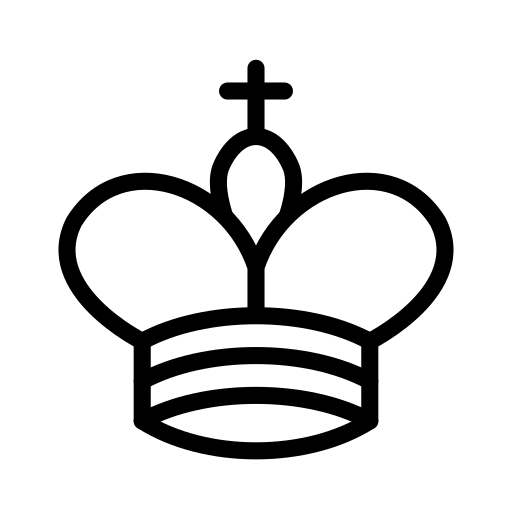
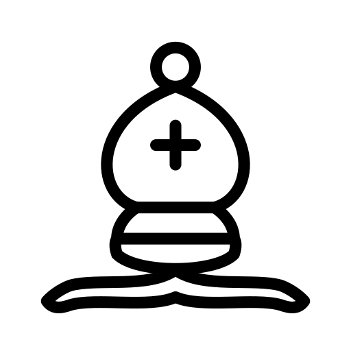

# Chess Assets

This **chess icons** where downloaded from: https://commons.wikimedia.org/wiki/Category:SVG_chess_pieces

Those are `.svg` files, which I then upscaled to `512x512` and converted to `.png`, which is used in **pygame**.

## Pieces

    
    

    
    

    
    

    
    

    
    

    
    

